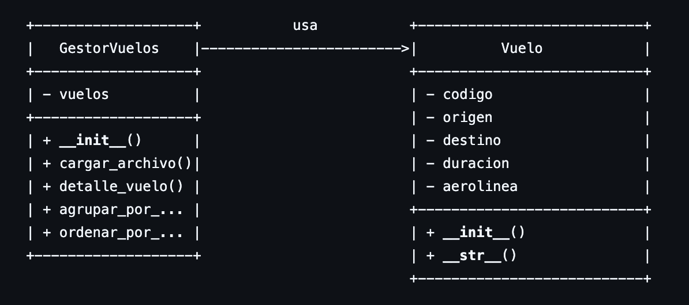

# Proyecto Tarea #1 

Universidad de San Carlos de Guatemala  
Facultad de Ingeniería - Escuela de Ciencias y Sistemas  
Curso: Introducción a la Programación y Computación 2  
Escuela de Vacaciones - Junio 2025  
Tutor del curso: Andrea María Cabrera Rosito  

## 👨‍💻 Descripción

TAREA 1 del curso de IPC2 en la cual se hace la gestion de vuelos mediante la lectura de un archivo xml

- Carga y validación del archivo XML.
- Consulta de vuelos específicos por código.
- Agrupación de vuelos por aerolínea.
- Ordenamiento de vuelos por duración (de mayor a menor).

Aux, en esta tarea se probó utilizar una verificacion de datos duplicados, entonces se agregó dicha verificacion de la clase `Vuelo`.

---

## 🚀 Requisitos

- Python 3.8
- Archivo de entrada `entrada.xml` se agrega automaticamente si no se le coloca el nombre del archivo.

---

## 📊 Diagrama de Clases

## 👤 Autor
Nombre: Gerson Ottoniel Batz Cocon
Carnet: 201503980

## 📹 Video de Demostración
https://drive.google.com/file/d/1Zw03jTnUs5f1bMta-AUtuY77jD5iCgbj/view?usp=sharing
